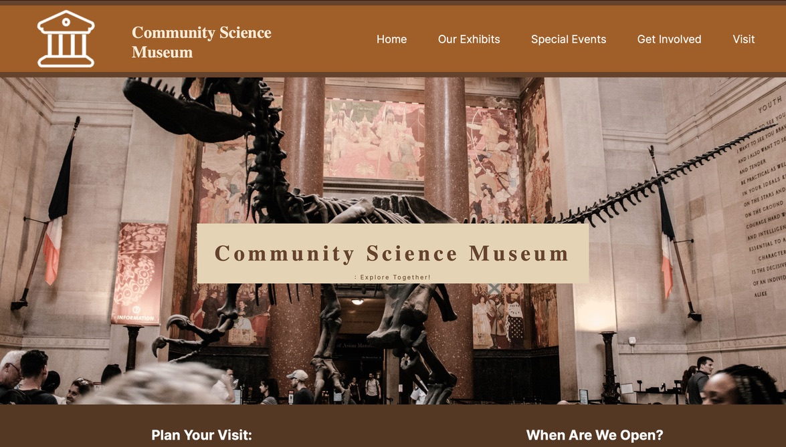

---

  

---

---

# Community Science Museum, - 

The first exam of our school year- 
This was a build of purely HTML and CSS, as we had not yet completed our JavaScript 1 module.
The brief was to build a website for a community science museum for children and young adults, to invite them to visit and display the exhibits .

Our brief--

    (An interactive science museum called the Community Science Museum is opening in your town/city. Its core target audience is primary and middle school children (ages 7-15)        and families with young children. The museum wants an informative, appealing website to attract middle school pupils and their parents. The site should appeal to youngsters       without pandering; it should take for granted that the audience is curious and intelligent. The website should be informative and engaging, encouraging viewers to visit the       museum. The website should be responsive and easy to use on various devices.

---

## Site purpose:

In its essence the exercise was to test our CSS and HTML skills- the brief itself was a child and young person-friendly, community science museum- 
To advertise the exhibits and special events that the museum was showing, what facilities were available for visiting schools and to let people know the location of the museum     itself.

---

### Description

-- Home Page

There was no specifics in our brief other than certain snippetd of information, and we could lay these out any way we saw fit--
My main page holds essential information such as the opening hours, ticket prices, the main and permanent exhibits and where individuals such as teachers planning trips, job seekers and scientists might look for further information.

-- Exhibits

Simply designed parralax scroll effect pages (In the hopes of a more exciting page for younger people) with each of the permanent exibitions on display.

-- Special Events

Specific events given, along with images for us to include in our design-- I used similar code to that used for the parralax effects on the home page

(Built with:)

  

---

#### Getting Started

** Installing **

-- To clone the repo:

    git clone git@github.com: https://github.com/AutopsyTurvy/CommunityScienceMuseum.git

Install the dependencies, (if running through command line or terminal):

    npm install

-- Running

To run the app, run the following commands (if running through command line or terminal):

    npm run start

You may also choose to add to/ clone this code in another way than through the command line or terminal, and you may do this by opening it in your chosen code editor, via GitHub desktop, and subsequently, VScode. 

---

-- Contributing

Contributions are welcome, but I would request that the invidicual that does so, clones the code and adds notes so that I can review any changes before they are comitted to the project permanently. Thank you! 

---

Contact:

Email me: 
autopsyturvycoding@gmail.com

 

Find me on Discord:
(Kitty Alice Case
kittyalicerayworth)

---

Acknowledgments

Thanks to my dear friend Jamie, who explained so much to me. 
